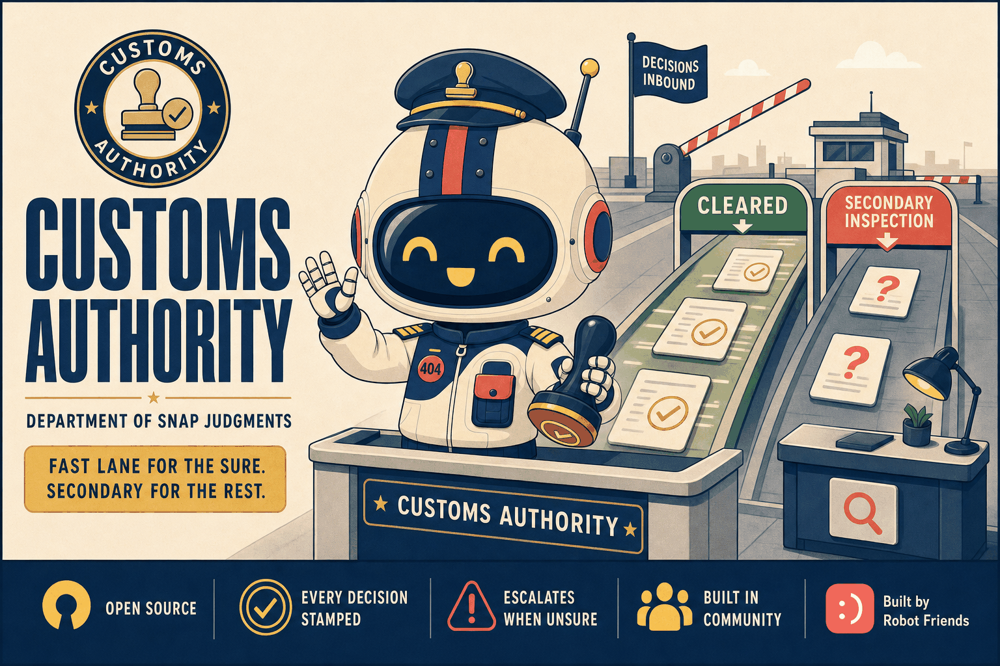
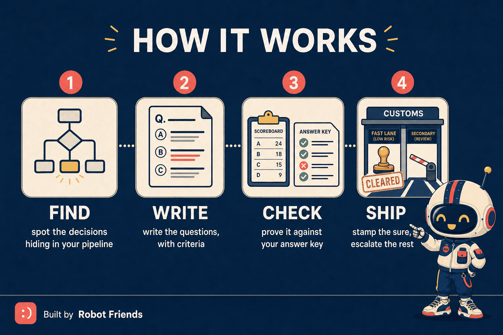
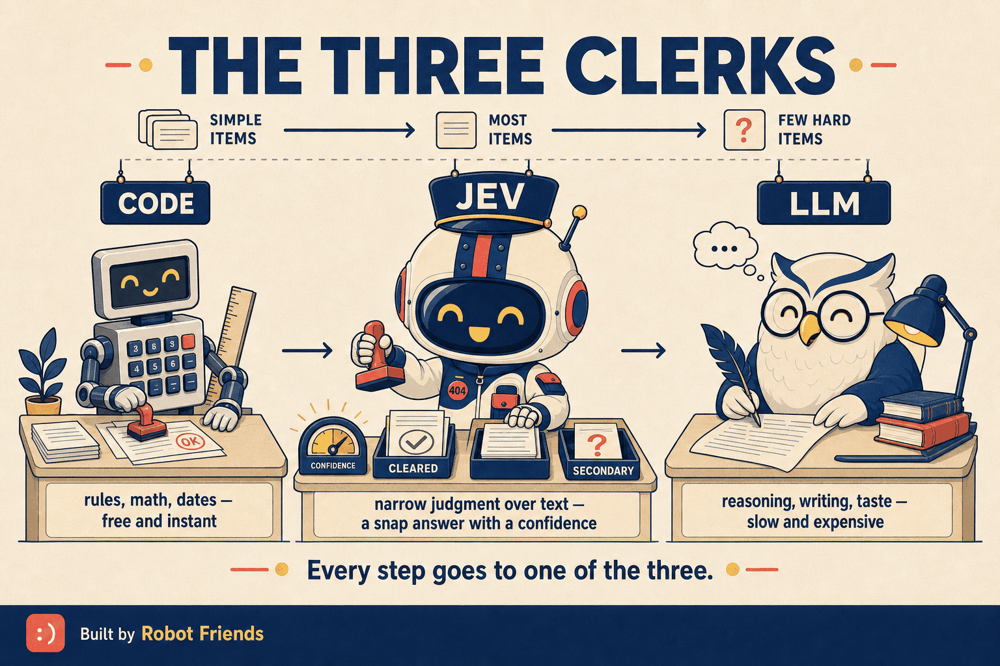

<div align="center">



**The decision-layer toolkit for Claude Code. Every small judgment in your app, inspected in 100 ms, stamped with a confidence — and sent to Secondary Inspection when it isn't sure.**

[](https://claude.ai/code)
[](LICENSE)
[](https://github.com/Robot-Friends-Community)

</div>

---

## What is this?

A customs authority doesn't read every traveler's life story. It asks a few pointed questions,
stamps the ones it's sure about, and sends the rest to a second desk. Fast lane for the sure,
secondary inspection for the unsure, nothing waved through on a guess.

**Customs Authority** brings that to the decision points inside your software. It's built
around [Jev](https://typesafe.ai), a new kind of AI model — not a chatbot, a **System One
decision model**. You hand it text and typed questions (*which category? how urgent? is this
on-topic?*) and it answers every one in parallel, in about a tenth of a second, for a fraction of
a cent, **with a calibrated confidence**. It can't write a sentence. It can make ten thousand small
judgments a minute and tell you which ones it's unsure about.

That confidence is the product. When it's high, your code acts. When it's low, the item goes to
**Secondary Inspection** — a person, or a big model that can actually think. You get the speed and
cost of the small model and the accuracy of the big one, and you stop paying LLM prices for
decisions that never needed an essay.

The kit is how you use it *well*: find the decisions, write questions that work, prove them on an
answer key, and ship the hybrid — guided step by step if you're new, terse if you're not.

<div align="center">

</div>

---

## Who is it for?

| You are… | Customs Authority gives you… |
|---|---|
| A founder or operator with a process full of "someone checks / sorts / flags" | A guided front desk (`/customs`) that finds those steps, writes the questions with you, and tells you honestly whether it works |
| A developer paying LLM prices for classification, routing, or scoring | A three-way triage (code / Jev / LLM) of every step, and a drop-in gated hybrid that cuts most of those calls |
| A team shipping an AI-powered app | An inbox intent router, board flags, lead scoring, guardrails, as-you-type qualification — each as an evaluated question set with a recorded gate |
| Anyone who's been burned by "the model is 85% accurate" | The scoreboard that says *85% overall, 99% on the 64% it's confident about* — and the gate to ship on |

---

## The three clerks

<div align="center">

</div>

Every step in a system goes to one of three workers. A rule you can write in one sentence goes
to **code**. A bounded judgment a sharp new assistant could make in two seconds with a checklist
goes to **Jev**. Anything that needs new text, reasoning, taste, arithmetic, or dates stays on the
**LLM** (or a person). Most systems have far more of the middle kind than anyone has counted —
because until now the middle clerk didn't exist.

---

## Install

```bash
claude plugin marketplace add Robot-Friends-Community/customs-authority
claude plugin install customs-authority@customs-authority
```

Then, in Claude Code:

```
/customs
```

The front desk checks whether you have a key (free, two minutes — it walks you through it), finds
any question sets in the project, and routes you to the right next step. `pip install httpx` is
the only dependency. Full setup for humans *and* for your AI sessions, including ready-to-paste
CLAUDE.md blocks: [`docs/SETUP.md`](docs/SETUP.md).

---

## The front desk and the skills

| Command | Ask it… | You get… |
|---|---|---|
| `/customs` | "Where am I?" | A doctor's read of your setup and the one right next step. `help` · `setup` · `status` · `tutorial` · `expert` (`/jev` is an alias) |
| `/jev-fit` | "Where would this help me?" | Every decision step in a project, triaged code / Jev / LLM, ranked, with one pilot to start on |
| `/jev-design` | "Write the questions" | A question set that works — the primitive, the state, criteria as situations and boundary cases, a who-we-are preamble, code that owns the decision |
| `/jev-label` | "Build the answer key" | ~100 rows labeled blind by a human, and the inter-labeler agreement that sets the ceiling any model can reach |
| `/jev-eval` | "Does it work? How sure?" | The scoreboard: accuracy, calibration, coverage→accuracy at every gate, latency, cost — and the gate to ship |
| `/jev-integrate` | "Put it in the app" | Key handling, Python / TypeScript client, the gated hybrid with fallback, public-route proxy, logging, pre-ship checklist |
| `/jev-playbook` | "Tell me everything" | What Jev is, costs, limits, failure modes, when (not) to use it |

Every skill has a **guided mode** (one step at a time, plain words, *why* before each question)
and an **expert mode** (artifacts, no narration). `/customs` picks one from how you talk; say
"expert" to switch.

Under the hood: `scripts/jev_eval.py` (the harness), `scripts/jev_label.py` (labeling, agreement,
import), `scripts/jev_status.py` (the doctor), `scripts/jev_client.py` (thin client + CLI),
`templates/` (task, hybrid router, `jev.ts`, Next.js route), a worked example in
`examples/linkdrop/`, and a [glossary](docs/GLOSSARY.md) + [FAQ](docs/FAQ.md).

---

## What we learned building it

Same 108 links, same model, the question asked nine ways:

| | accuracy |
|---|---|
| bare 2-way choice, no criteria text | 70% |
| one sentence of criteria per option | **88%** |
| concrete situations + boundary cases + who-we-are | **90%** |
| Claude Sonnet, same criteria (the ceiling) | 96% |
| **Jev at confidence ≥ 0.85, Sonnet for the rest** | **95.4%, with 64% fewer LLM calls** |

Three rules fell out of that, and the whole kit encodes them:

1. **Criteria text is the lever.** Nothing else you do moves the number that much.
2. **Confidence is the product.** Gate on it; escalate below it.
3. **Ship the hybrid.** Jev where it's sure, the big model or a person for the rest.

And one rule of the house: **nothing ships without a scoreboard.** Full ladder:
[`examples/linkdrop/SCOREBOARD.md`](examples/linkdrop/SCOREBOARD.md).

---

## The path

```
/customs  →  /jev-fit  →  /jev-design  →  /jev-label  →  /jev-eval  →  /jev-integrate
front desk    where?        questions      answer key     scoreboard     hybrid in prod
```

Ten minutes on the bundled example (`/customs tutorial`) is enough to *feel* the first two rules.

---

## Not a fit for

Creative direction, critique, naming · judging the quality of LLM or code output · research claim
verification · numbers, dates, counting · multi-hop conditions · text generation · adversarial
public input without criteria and tests · non-English without a test. The playbook has the full
list and the model's documented failure modes.

---

## Lineage

Built at [Robot Friends](https://github.com/Robot-Friends-Community) in September 2026 after a
two-day deep dive: watch the launch coverage → read every doc page → benchmark on our own labeled
data → map it to our business → distill the rules into skills → then make it easy enough for a
non-engineer to run. Sibling of [Airport Authority](https://github.com/Robot-Friends-Community/airport-authority)
(session continuity for Claude Code) and [DoPA](https://github.com/Robot-Friends-Community/dopa)
(the port authority for your local dev servers) — same universe, same conviction that the
plumbing should be handled by an institution with a mandate, not remembered by a person.
Cousin of [`algo-lens`](https://github.com/Robot-Friends-Community/toolbox) ("fire the LLM, hire
an algorithm") — Customs Authority covers the judgment steps algo-lens leaves on the LLM.

## Contributing

Question sets and gold sets are the valuable part. PRs that add a worked example (task + gold +
scoreboard) for a new decision family are the most welcome kind.

## License

MIT © Robot Friends (404NOTFOUND LLC). Not affiliated with TypeSafe AI.
